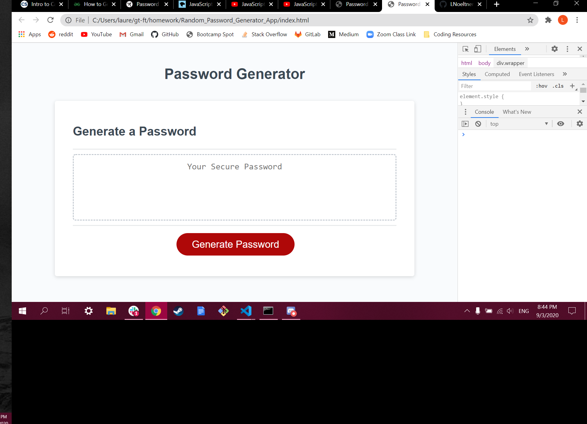

## Random Password Generator App

==========

In this project, we were tasked with creating a random password generator application in which the user could decide the number of characters in the password and whether the user would like to include lower-case letters, upper-case letters, numbers and/or special characters. When the user clicks the generate button, they will select true or false for each character type, and they will recieve a series of alerts, reminding them of their selected character types. If they enter an invalid password length, they will recieve an error message telling them that they must enter a number in the pre-determined range (8-128 characters). I learned to concatenate different strings of character classes and select one random character from the concatenated strings for every for-loop (the number of which is defined by the user in the initial prompt). When the loop ends after the requested number of times, a random password is displayed in the text box, containing the correct number of characters within the selected character classes.

## Screenshot

[GitHub Repository](https://github.com/LNoeltner1/Random_Password_Generator_App)

## License

None. The HTML and CSS sheets were pre-finished. My contribution was in writing the JavaScript sheet.
